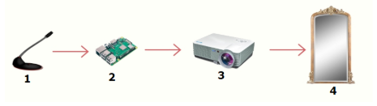

# [Objetos Inteligentes Conectados] 09 out. 2019

## Turma 5J11
## Projeto: "Espelho Inteligente"
## Integrantes do grupo:

* Leticia Souza
* Nathalia Sellis
* Rafael Acayaba
* Fernando 

## Descrição resumida do projeto

A proposta do projeto é criar um espelho inteligente, toda pergunta realizada será refletida no espelho.  

## Descrição do hardware utilizado :
 - Processador Rasberry Pi 3b 
 - Celular para comando de voz
 - Projetor
 - Caixas de som
 
 ### Protótipo

 
_______________________________________
Obs:

`src/` deve conter os códigos desenvolvidos

`doc/` documentação do projeto
